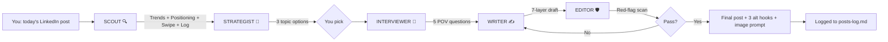

# Content Daily

> 5 AI agents. One LinkedIn post. Zero AI slop.

A Claude Code skill that runs your LinkedIn content through a rigid 5-phase pipeline. No more generic ChatGPT posts. The skill researches what's trending, extracts YOUR opinion through 5 sharp questions, then writes in your voice using a 7-layer framework. Auto-scans for AI red flags before showing you the draft.

---

## The 5 Agents

```
  ┌─────────────┐    ┌─────────────┐    ┌─────────────┐    ┌─────────────┐    ┌─────────────┐
  │             │    │             │    │             │    │             │    │             │
  │   ▄█████▄   │    │    ▄███▄    │    │   ▄█▀ ▀█▄   │    │   ▄█████▄   │    │    ▄███▄    │
  │   █ ▄ ▄ █   │    │   █ ◉ ◉ █   │    │   █ ◉ ◉ █   │    │   █ ▀ ▀ █   │    │   █ ✕ ✕ █   │
  │   █  ▼  █   │    │   █  ▼  █   │    │   █  ◯  █   │    │   █  ▽  █   │    │   █  ━  █   │
  │   ▀█████▀   │    │    ▀█▄█▀    │    │    ▀█▄█▀    │    │   ▀█████▀   │    │    ▀█▄█▀    │
  │   ▌█ █ █▐   │    │   ▌▒ ▒ ▒▐   │    │   ▌█▒█▒█▐   │    │   ▌█ █ █▐   │    │   ▌█▓█▓█▐   │
  │   ▀█▀ ▀█▀   │    │   ▀█▀ ▀█▀   │    │   ▀█▀ ▀█▀   │    │   ▀█▀ ▀█▀   │    │   ▀█▀ ▀█▀   │
  │             │    │             │    │             │    │             │    │             │
  │   SCOUT     │    │  STRATEGIST │    │ INTERVIEWER │    │   WRITER    │    │   EDITOR    │
  │             │    │             │    │             │    │             │    │             │
  │  Research   │    │ Pick topic  │    │  5 Q's POV  │    │  7 layers   │    │ Red-flag    │
  │  trending   │    │  + hook     │    │  extract    │    │  draft      │    │ scan        │
  │  topics     │    │  angle      │    │  opinion    │    │             │    │ + alts      │
  └─────────────┘    └─────────────┘    └─────────────┘    └─────────────┘    └─────────────┘
        │                   │                   │                   │                   │
        ▼                   ▼                   ▼                   ▼                   ▼
     PHASE 0            PHASE 1            PHASE 2            PHASE 3            PHASE 3d
```

---

## How It Works



---

## What You Get

```
━━━━━━━━━━━━━━━━━━━━━━━━━━━━━━
YOUR POST
━━━━━━━━━━━━━━━━━━━━━━━━━━━━━━

[Final post copy in YOUR voice — paste-ready]

━━━━━━━━━━━━━━━━━━
STRUCTURE NOTES
━━━━━━━━━━━━━━━━━━
Archetype: Contrarian Truth
Hook type: Shock/Contradiction
Target: ICP
Pillar: Authority
Length: 920 words

━━━━━━━━━━━━━━━━━━
ALTERNATE HOOKS
━━━━━━━━━━━━━━━━━━
1. [Different pattern]
2. [Different pattern]
3. [Different pattern]

━━━━━━━━━━━━━━━━━━
POSTING CHECKLIST
━━━━━━━━━━━━━━━━━━
- [ ] Post live (never schedule)
- [ ] Stay first 30 min
- [ ] Reply to every comment
- [ ] Comment on 3 ICP posts
- [ ] DM substantive commenters
```

---

## What Makes It Different

| Generic AI tool | Content Daily |
|-----------------|---------------|
| Writes from a prompt | Researches trends + your positioning + your hook history first |
| Sounds like ChatGPT | Reads your voice card + writes in YOUR style |
| Generic hooks | 21+ hook templates, never repeats one from last 30 days |
| Slop-prone | Mandatory red-flag scan before output (em dashes, stock phrases, triplets, sycophantic openers) |
| One-shot | Logs every post for performance tracking |
| No memory | Auto-checks posts-log to avoid repeating topics + hooks |

---

## Install (3 minutes)

### Requirements
- Claude Code installed → https://claude.com/claude-code
- 30 minutes to fill out 2 templates (positioning + voice card)

### Steps

```bash
# 1. Create your content system folder
mkdir -p ~/content-system

# 2. Drop the 5 templates in
cp templates/* ~/content-system/

# 3. Install the skill
mkdir -p ~/.claude/skills/content-daily
cp SKILL.md ~/.claude/skills/content-daily/SKILL.md
```

### Fill out the 2 templates that matter

```
~/content-system/
├── positioning.md   ← FILL THIS (5 min — niche, ICP, pillars, enemy)
├── voice-card.md    ← FILL THIS (30 min — 12 questions about your style)
├── swipe-hooks.md   ← works as-is
├── posts-log.md     ← empty, fills as you post
└── writing-sop.md   ← works as-is
```

### Test it

Open Claude Code anywhere. Type:

```
today's LinkedIn post
```

Skill fires. Walks you through the 5 phases. Drops final post + alt hooks + checklist.

---

## File Structure

```
content-daily/
├── SKILL.md         ← The 5-agent pipeline (lives in ~/.claude/skills/content-daily/)
├── SETUP.md         ← Detailed install guide
├── README.md        ← This file
└── templates/
    ├── positioning.md   ← Your niche, ICP, IFP, 3 pillars, enemy
    ├── voice-card.md    ← 12 questions that define your voice
    ├── swipe-hooks.md   ← 7 archetypes + 21 templates + anti-patterns
    ├── posts-log.md     ← Append-only memory of every post
    └── writing-sop.md   ← 7-layer framework + red-flag scanner
```

---

## The 7 Layers (every post follows this)

```
LAYER 1  ▓▓▓▓▓▓▓▓▓▓░░░░░░░░░░  Hook        (1-2 lines, max 12 words/line)
LAYER 2  ░░▓▓▓▓▓▓▓▓░░░░░░░░░░  Context     (under 80 words, ONE moment)
LAYER 3  ░░░░▓▓▓▓▓▓▓▓▓▓▓▓░░░░  Emotion     (150-200 words, sensory)
LAYER 4  ░░░░░░░░▓▓▓▓▓▓▓▓▓▓░░  Value       (150-200 words, your POV)
LAYER 5  ░░░░░░░░░░░░▓▓▓▓░░░░  Rehook      (~50 words at 60% mark)
LAYER 6  ░░░░░░░░░░░░░░░░▓▓▓▓  CTA         (20-40 words, open question)
LAYER 7  ░▓░▓░▓░▓░▓░▓░▓░▓░▓░  Format      (whitespace + flow)
```

---

## The Red-Flag Scan (banned in every post)

```
✗  Em dashes (—)
✗  "It's not about X, it's about Y."
✗  Triplet endings: "Same X. Same Y. Same Z."
✗  Stock corporate words: revolutionary, game-changing, skyrocket, leverage, dive deep
✗  Sycophantic openers: "Great question," "Love this"
✗  Lists always exactly 3 items (vary the count)
✗  Zero contractions (humans use don't/can't/won't)
✗  Zero hedging ("kinda", "I think", "honestly")
```

If any present → skill rewrites + rescans before showing you anything.

---

## Cost

Free. Runs inside your Claude Code subscription. No external APIs, no per-post charges.

---

## Troubleshooting

**Skill doesn't fire?**
- Confirm `~/.claude/skills/content-daily/SKILL.md` exists
- Restart Claude Code
- Try `/content-daily` directly

**Posts feel generic?**
- Voice card is the engine. Spend 30 min filling it properly.
- Add a real sample post you wrote (Q5 of voice-card.md)
- Add an anti-sample (Q6) — what NOT to sound like

**"positioning.md not found"?**
- Run: `ls ~/content-system/` — should show 5 files
- Folder must be `content-system` (lowercase, hyphen)

---

## What This Won't Do

- Schedule posts to LinkedIn (post manually — this is generation only)
- Generate images (use Midjourney/Higgsfield/etc separately)
- Replace your judgment (always read + edit before posting)

---

## License

MIT — fork, modify, ship. Just keep your voice card private (it's your moat).
